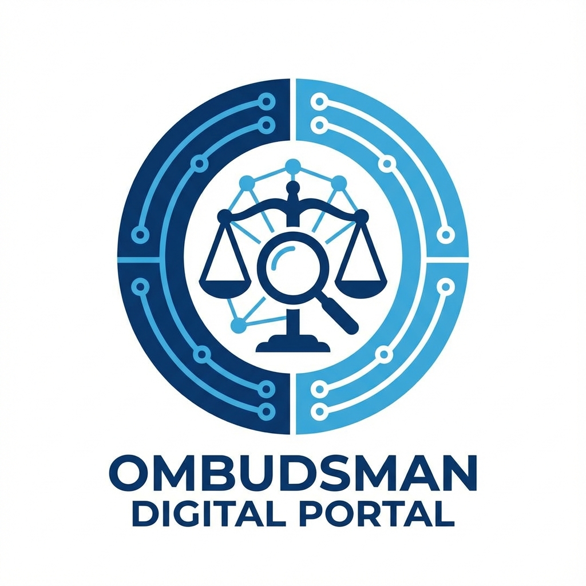

# 🇸🇱 Ombudsman Digital Complaint Portal

**A secure, transparent platform for citizens of Sierra Leone to report public service issues and track their resolution.**

> **Big 5 AI and Blockchain Hackathon Submission** > **Category:** Ombudsman Complaint Portal



## 📖 Project Overview

The Ombudsman Digital Complaint Portal is a modern web application designed to bridge the gap between citizens and the Office of the Ombudsman. It allows for:

1.  **Secure Complaint Submission**: Citizens can easily file complaints against Ministries, Departments, and Agencies (MDAs).
2.  **Real-time Tracking**: Users receive a unique Reference ID to track their case status.
3.  **SMS Notifications**: Automated updates via Twilio keep citizens informed.
4.  **Admin Dashboard**: A powerful interface for the Ombudsman's office to manage, review, and resolve cases.
5.  **Data Analytics**: Visual insights into complaint trends and hotspots.

## ✨ Key Features

- **User-Friendly Interface**: Built with React and Tailwind CSS for accessibility and speed.
- **Anonymous Reporting**: Option to submit complaints without fear of reprisal.
- **Export to Excel**: Admins can export case data for official reporting.
- **Mobile Responsive**: Fully functional on smartphones and tablets.
- **Robust Backend**: Powered by FastAPI (Python) for high performance.

## 🛠️ Tech Stack

- **Frontend**: React, TypeScript, Vite, Tailwind CSS, Lucide Icons
- **Backend**: Python, FastAPI, SQLAlchemy, Pydantic
- **Database**: SQLite (Dev) / PostgreSQL (Prod ready)
- **Services**: Twilio (SMS), Railway (Hosting), Vercel (Frontend Hosting)

## 🚀 How to Run Locally

### Prerequisites

- Node.js (v18+)
- Python (v3.9+)

### 1. Backend Setup

```bash
cd backend
python -m venv venv
source venv/bin/activate  # or venv\Scripts\activate on Windows
pip install -r requirements.txt
uvicorn main:app --reload
```

### 2. Frontend Setup

```bash
cd frontend
npm install
npm run dev
```

## 👨‍⚖️ Judges & Reviewers

This repository is organized as follows:

- `/frontend`: The React application source code.
- `/backend`: The FastAPI server and database models.
- `vercel.json`: Configuration for Vercel deployment.

**Admin Credentials (Demo):**

- **Login URL**: `/admin`
- **Token**: `secret-admin-token`

---

_Built with ❤️ for Sierra Leone 🇸🇱_
